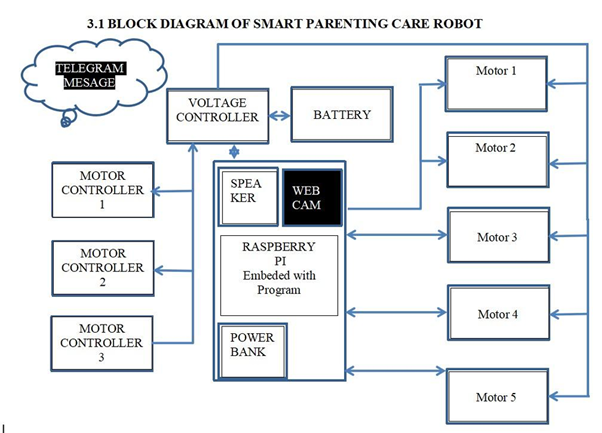

# Smart Parenting Care Robot

## Overview

The Smart Parenting Care Robot is an AI-powered child monitoring and assistance system designed to help parents monitor and ensure the safety of children. The system uses sensors and a processor to track the child's activity and provide alerts when needed.

## System Block Diagram

### Block Diagram Explanation

The Raspberry Pi acts as the main controller of the Smart Parenting Care Robot. It runs the program that controls the robot’s operations and processes commands received from the user.

The battery provides power to the entire system, while the voltage controller ensures stable and regulated power supply to all electronic components.

A webcam is used for visual monitoring so that parents can observe the child remotely. The speaker enables the robot to provide audio output such as alerts or voice messages.

Motor controllers act as an interface between the Raspberry Pi and the motors. They receive control signals from the Raspberry Pi and provide sufficient power to operate the motors.

Finally, the motors enable the robot to move and perform different actions. Through Telegram messaging, caregivers can send commands and receive updates from the robot remotely.

## Project Images
### Hardware Setup
.jpg)
.jpg)
.jpg)
.jpg)
.jpg)
.jpg)
.jpg)
.jpg)
.jpg)

### Working Demo

### Project Setup

## Features

* Child activity monitoring
* Temperature monitoring
* Heart rate monitoring
* Live video monitoring
* Alert notifications to caregivers
* Smart assistance using sensors and automation

## Technologies Used

* Raspberry Pi / Processor
* Python Programming
* Sensors (Temperature, Heart Rate, Accelerometer)
* Camera Module
* IoT Communication
* Telegram Alert System

## Project Components

* Processor (Raspberry Pi)
* Camera Module
* Temperature Sensor
* Heart Rate Sensor
* Accelerometer
* Motors and Wheels
* Speaker Module
* Internet Connectivity

## Applications

* Smart child monitoring
* Home safety assistance
* Parenting support system
* AI-assisted home care systems

## Future Improvements

* Mobile application integration
* AI-based child behavior analysis
* Voice assistant integration
* Cloud monitoring dashboard

## Author

Project developed as an academic project.

## Code

The project code is available in the `code` folder.

### Main File
- `code/main.py` – controls robot movement, door operations, and basic voice output using Raspberry Pi GPIO.

## Notes
- This project is designed for Raspberry Pi hardware.
- Required Python libraries include `RPi.GPIO`, `pygame`, `gTTS`, `mutagen`, and `telepot`.
- GPIO pin numbers may need to be changed based on the actual hardware connection.
